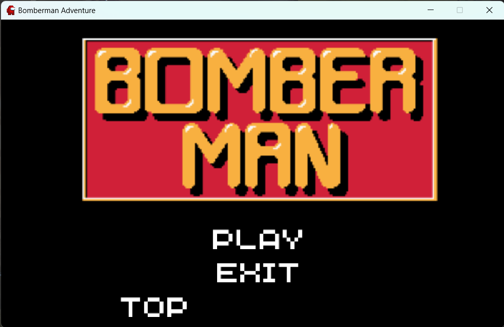
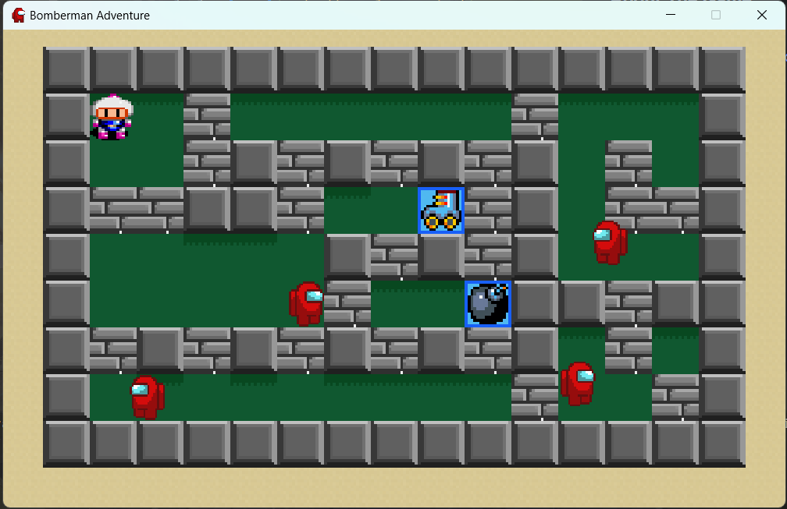
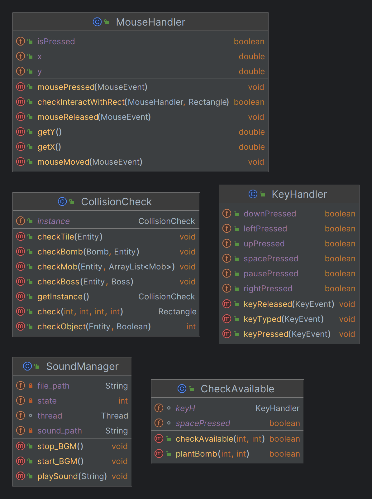
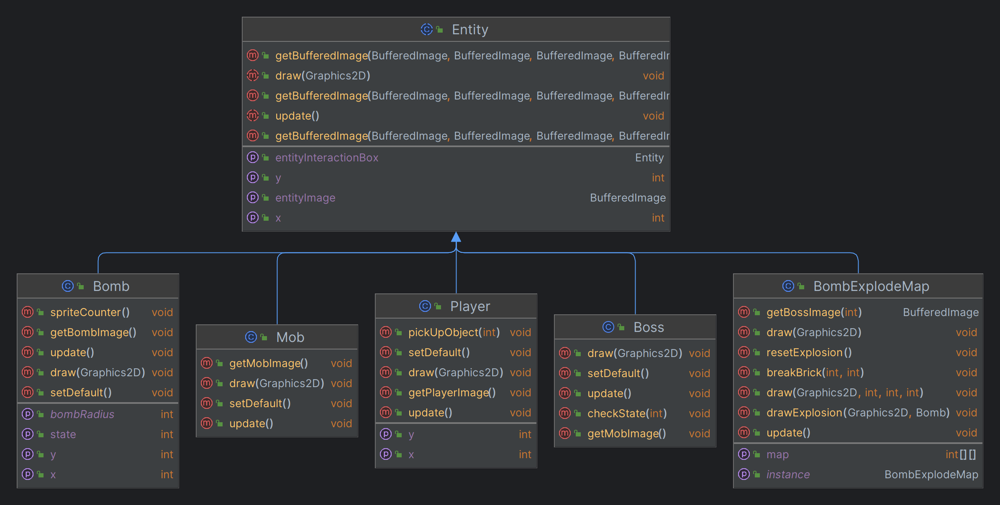
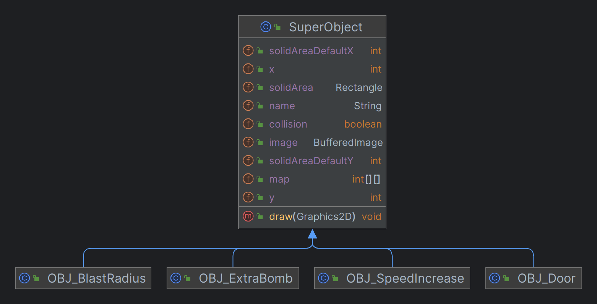
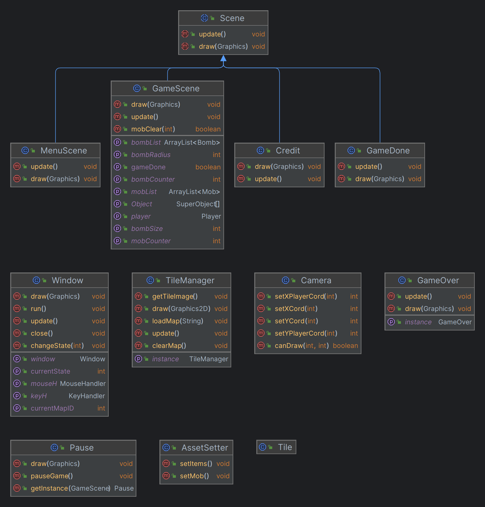
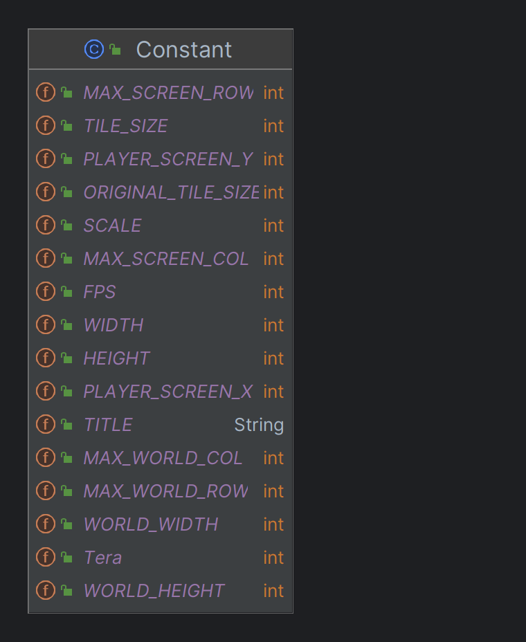

[![Contributors][contributors-shield]][contributors-url]
[![Forks][forks-shield]][forks-url]
[![Stargazers][stars-shield]][stars-url]
[![Issues][issues-shield]][issues-url]

# Bomberman

<!--suppress ALL -->
<div align="center">

</div>

<!-- TABLE OF CONTENTS -->

# Table of contents

1. [Introduction](#Introduction)
2. [Game](#Game)
3. [UML-diagram](#UML-diagram)
4. [Features](#Features)
5. [Challenges](#Challenges)

<!-- <details>
<summary>Table of Contents</summary>
<ol>
    <li>
        <a href="#Introduction">Introduction</a>
        <ul>
            <li><a href="#Team-Members">Team Members</a></li>
            <li><a href="#How-to-Run">How to Run</a></li>
            <li><a href="#Task-Allocation">Task Allocation</a></li>
        </ul>
    </li>
    <li>
        <a href="#Game">Game</a>
        <ul>
            <li><a href="#About-the-Game">About the Game</a></li>
            <li><a href="#Controls">Controls</a></li>
            <li><a href="#Items">Items</a></li>
        </ul>
    </li>
    <li><a href="#UML-diagram">UML-diagram</a></li>
    <li><a href="#Features">Features</a></li>
    <li><a href="#Challenges">Challenges</a></li>
</ol>
</details> -->

<!-- ABOUT THE PROJECT -->

## Introduction <a name="Introduction"></a>

<div style = "text-align: justify">
This is our Bomberman project for the Object-Oriented Programming course at HCMIU in semester 1 (2022-2023). We all knew that the game is a classic, but we wanted to make it more interesting and challenging. So we decided to add some new features to the game. We hope you enjoy it!
</div>

### Team Members

| Order |         Name          | Student ID  |
|:-----:|:---------------------:|:-----------:|
|   1   |   Tran Nguyen Phuc    | ITCSIU21097 |
|   2   | Nguyen Mach Khang Huy | ITCSIU21072 |
|   3   |   Nguyen Tuan Khoa    | ITCSIU21140 |
|   4   | Nguyen Manh Viet Khoi | ITCSIU21081 |
|   5   |     Pham Vu Quang     | ITITIU21096 |

### How to run

1. Clone this repository
    ```sh
    git clone https://github.com/tnphucccc/Bomberman
    ```
2. Open the project with IntelliJ IDEA or VSCode and check the file status
    ```sh
    git status
    ```
3. Run the project
4. Enjoy the game

### Task Allocation

| Order |         Name          |                      Task                      | Contribution |
|:-----:|:---------------------:|:----------------------------------------------:|:------------:|
|   1   |   Tran Nguyen Phuc    | Controls, GUI, Maps, Entities, Sound, UML, git |      20      |
|   2   | Nguyen Mach Khang Huy |               Objects, Controls                |      20      |
|   3   |   Nguyen Tuan Khoa    |               Entities, Controls               |      20      |
|   4   | Nguyen Manh Viet Khoi |        GUI, Entities, Objects, Debugger        |      20      |
|   5   |     Pham Vu Quang     |                   GUI, Maps                    |      20      |

<!-- Game -->

## Game <a name="Game"></a>

### About The Game

<div align="center">

</div>

- Language: [Java](https://www.java.com/en/)
- IDEs: [IntelliJ IDEA](https://www.jetbrains.com/idea/), [VSCode](https://code.visualstudio.com/)
- Library: [JavaSwing](https://docs.oracle.com/javase/tutorial/uiswing/)
- Game Engine: [Java2D](https://docs.oracle.com/javase/7/docs/api/java/awt/Graphics2D.html)
- Sound: [JavaSound](https://docs.oracle.com/javase/7/docs/api/javax/sound/sampled/Clip.html)

### Controls

|  Key  |   Action   |
|:-----:|:----------:|
|  UP   |  Move Up   |
| DOWN  | Move Down  |
| LEFT  | Move Left  |
| RIGHT | Move Right |
| SPACE | Place Bomb |
|   P   |   Pause    |

<div style = "text-align: justify">
The character is controlled by the arrow keys and the space bar. The player can move the character by pressing the arrow
keys. The player can place a bomb by pressing the space bar. The player can pause the game by pressing the P key.
</div>

### Items

|      Item       |              Effect              |
|:---------------:|:--------------------------------:|
|   Extra Bomb    |   Increase the number of bombs   |
|  Blast Radius   |   Increase the range of bombs    |
| Boots of Hermes | Increase the speed of the player |

<!-- UML-diagram -->

## UML-diagram <a name="UML-diagram"></a>

<div>
    <h3>Controls Diagram</h3>
        <div align="center">
            
        </div>
    <br />
    <h3>Entities Diagram</h3>
        <div align="center">
            
        </div>
    <br />
    <h3>Objects Diagram</h3>
        <div align="center">
            
        </div>
    <br />
    <h3>GUI Diagram</h3>
        <div align="center">
            
        </div>
    <br />
    <h3>Constant</h3>
        <div align="center">
            
        </div>
</div>

<!-- Features -->

## Features <a name="Features"></a>

<div style = "text-align: justify">
   Unlike the original game, in this version, we decided to change something in the gameplay to make it a bit differ. We added some new features to the game, such as: <br/>
- The player can move faster by picking up the Boots of Hermes item. <br/>
- The player can place more bombs at the same time by picking up the Extra Bomb item. <br/>
- The player can increase the range of bombs by picking up the Blast Radius item. <br/>
- The player can pause the game by pressing the P key. <br/>
- There 2 maps currently in the game, with different obstacles and enemies. <br/>
- The boss will appear in map 2, with a lot of health and will track the player. To kill the boss, you have to be patient and wait for the right time to attack. <br/>
- After defeating the boss, you will win the game and become the "Hero of the BomberLand". <br/>
</div>

<!-- Challenge -->

## Challenge <a name="Challenge"></a>

<div style = "text-align: justify">
   The most challenging part of this project is the collision detection. We had to make sure that the player can't go through the walls, the enemies can't go through the walls and the bombs can't go through the walls. We also had to make sure that the player can't place a bomb on the wall. <br/>
   Another challenging part is the boss. We had to make sure that the boss can track the player and attack the player. We also had to make sure that the boss can't go through the walls. <br/>
   During the process, there were some bugs like: <br/>
- The player can place a bomb on the wall. <br/>
- Player and enemies can go through the walls. <br/>
- Bomb explode through the walls. <br/>
- Collision detection is not working properly. <br/>
   Fixing these bugs took us a lot of time, but it help us learn a lot of things about the game. <br/>
</div>

<p align="right">(<a href="#top">Back to top</a>)</p>

<!-- MARKDOWN LINKS & IMAGES -->
<!-- https://www.markdownguide.org/basic-syntax/#reference-style-links -->

[contributors-shield]: https://img.shields.io/github/contributors/tnphucccc/Bomberman.svg?style=for-the-badge

[contributors-url]: https://github.com/tnphucccc/Bomberman-Adventure/graphs/contributors

[forks-shield]: https://img.shields.io/github/forks/tnphucccc/Bomberman.svg?style=for-the-badge

[forks-url]: https://github.com/tnphucccc/Bomberman-Adventure/network/members

[stars-shield]: https://img.shields.io/github/stars/tnphucccc/Bomberman.svg?style=for-the-badge

[stars-url]: https://github.com/tnphucccc/Bomberman-Adventure/stargazers

[issues-shield]: https://img.shields.io/github/issues/tnphucccc/Bomberman.svg?style=for-the-badge

[issues-url]: https://github.com/tnphucccc/Bomberman-Adventure/issues